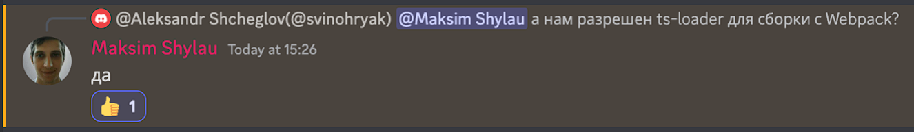

Precondition:
You have to have nodejs v22

For run do next steps:  

1. npm i
2. rename ".env.example" to ".env"
3. a) npm run start:dev - run development version of app  
   b) npm run start:prod - make build and run it from bundle  
   c) npm run start:multi - run several servers depended on your cpus amount
4. run test by "npm run test" command

Additional:  
you can import postman collection to check requests
from file "RSSchool nodejs.postman_collection.json"

and few words about ts-loader =)

